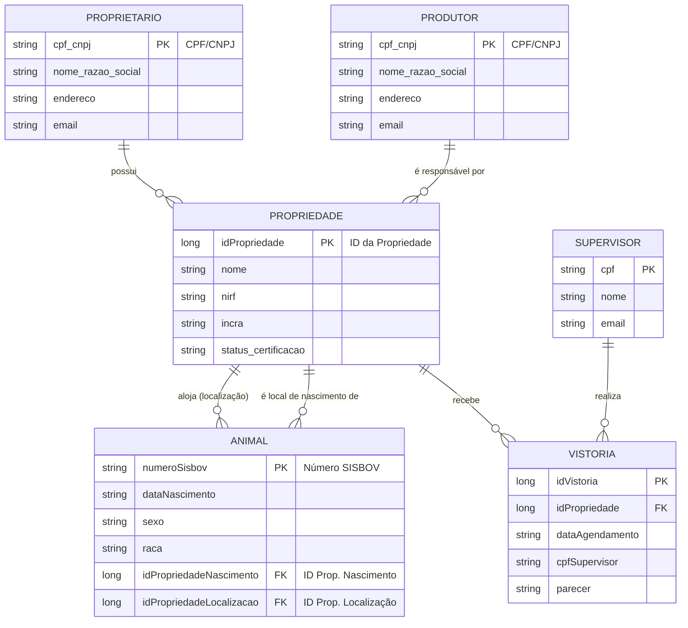

# Diagrama de Entidade e Relacionamento

Este diagrama ilustra as principais entidades do sistema SISBOV e como elas se relacionam entre si. Ele fornece uma visão estrutural dos dados gerenciados pelo web service.

## Código em Mermaid

Você pode copiar e colar o código abaixo em um editor de Markdown com suporte a Mermaid (como o do GitHub, GitLab, ou editores online) para visualizar o diagrama.

## Descrição das Relações

-   **Proprietário e Propriedade:** Um `PROPRIETARIO` pode possuir uma ou mais `PROPRIEDADE`s. A relação é de "um para muitos".
-   **Produtor e Propriedade:** Um `PRODUTOR` pode ser responsável por uma ou mais `PROPRIEDADE`s. Esta é a entidade que efetivamente maneja os animais.
-   **Propriedade e Animal:** Uma `PROPRIEDADE` tem duas relações importantes com o `ANIMAL`:
    1.  É o local de nascimento (`idPropriedadeNascimento`).
    2.  É o local onde o animal se encontra atualmente (`idPropriedadeLocalizacao`). Uma propriedade pode alojar muitos animais.
-   **Propriedade e Vistoria:** Uma `PROPRIEDADE` recebe uma ou mais `VISTORIA`s ao longo do tempo para obter e manter sua certificação.
-   **Supervisor e Vistoria:** Um `SUPERVISOR` é o profissional técnico que realiza uma ou mais `VISTORIA`s.
