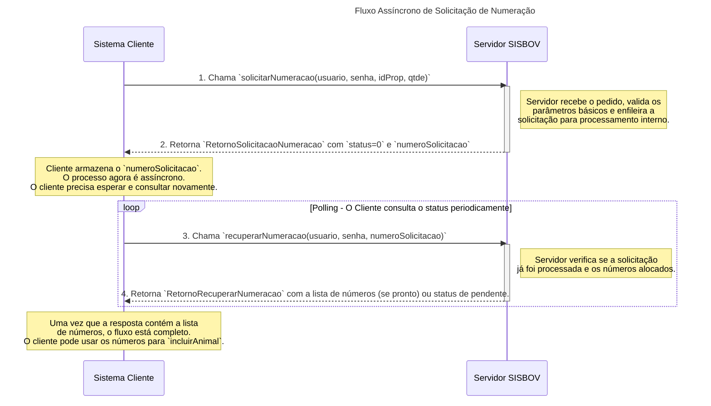

# Diagrama de Sequência: Solicitação de Numeração

Este diagrama ilustra a natureza assíncrona do processo de solicitação de novos números de identificação (brincos) no SISBOV. Ele mostra a interação entre o sistema cliente (da certificadora ou produtor) e o servidor do SISBOV.

## Código em Mermaid

## Descrição do Fluxo

1.  **Solicitação Inicial:** O `Cliente` inicia o processo chamando `solicitarNumeracao`. Ele não recebe a lista de números de volta imediatamente.
2.  **Resposta Imediata:** O `Servidor` responde rapidamente com um número de protocolo (`numeroSolicitacao`). Isso confirma que o pedido foi recebido e está na fila para ser processado, mas não que foi concluído.
3.  **Consulta (Polling):** O `Cliente` precisa, de tempos em tempos, chamar a operação `recuperarNumeracao`, usando o protocolo que recebeu. Esse processo é conhecido como *polling*.
4.  **Resposta Final:** O `Servidor` eventualmente processará a solicitação. Na próxima vez que o `Cliente` chamar `recuperarNumeracao`, a resposta virá preenchida com a lista de números SISBOV alocados e prontos para uso.

Este fluxo assíncrono é comum em sistemas que precisam realizar tarefas em segundo plano que podem levar mais tempo, como a alocação de recursos únicos (neste caso, os números de identificação).
